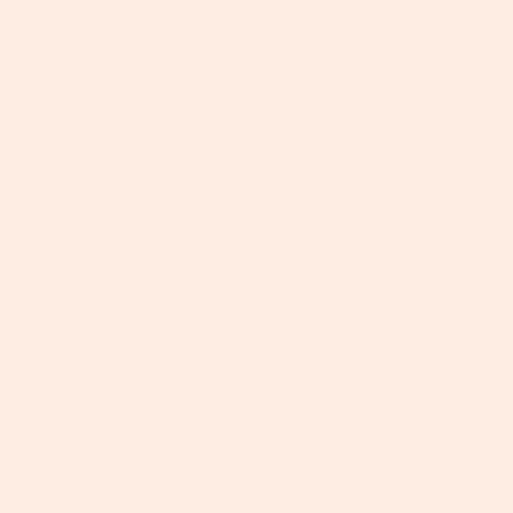

# quanta-strike



A modern pixel typeface. I draw each size by hand. Non-integer scaling ruins
pixels, so this repo ships a family of _strikes_. Each strike is its own design
for one target size.

💾 [**Download .ttf and .woff2**](https://github.com/dithernaut/quanta-strike/releases/latest/download/quanta-strike.zip)

📖 **Read the story:** [dithernaut.com/posts/pixel-scaling](https://dithernaut.com/posts/pixel-scaling)


## Glyphs

Each strike supports at least the following glyphs:

```
ABCDEFGHIJKLMNOPQRSTUVWXYZ
abcdefghijklmnopqrstuvwxyz
ᴀʙᴄᴅᴇꜰɢʜɪᴊᴋʟᴍɴᴏᴘꞯʀꜱᴛᴜᴠᴡ✗ʏᴢ

 ,.:;?¿!¡|()[]{}+-–—*÷_@'%
ʻʼ“ˮ#$€£^&°〈〉~/\`=×"‘’‚”„<
>≪≫©®§…•ªº¥¢≠±≈∓∆∏∑∫Ππ¤→↑←
↓‰∐∇√∞≂≃≤≥≡≢≣⪡⪢↔↕‛‟‼‽⌘™¦†
‡№⌥⁊‐✓µ♩♪♫♬―ƒ฿℮₿₣₴₺ℓ₽₹₪₸₮⁒
Ω█▓▒░

áâàäåãǎāæçćčċđéêèëẽēėęíîìïı
ǐĩįñńņňóôòöõøōœšşśßúûùüǔũūű
ůýÿŷžźżÁÂÀÄÅÃǍĀÆÇĆČĊĐÉÊÈËẼĒ
ĖĘÍÎÌÏǏĨĮÑŃŅŇÓÔÒÖÕØŌŒŠŞŚẞÚÛ
ÙÜǓŨŪŰŮÝŸŶŽŹŻ

0123456789
⁰¹²³⁴⁵⁶⁷⁸⁹
₀₁₂₃₄₅₆₇₈₉
```

Each strike also supports [old style figures](https://en.wikipedia.org/wiki/Text_figures), and [small caps](https://en.wikipedia.org/wiki/Small_caps).

## What this repo is

Source art lives in `src/` as PNG + JSON pixel sheets. The build compiles each
sheet into fonts, stamps metadata, adds OpenType features, and writes WOFF2 plus
CSS.

Every strike builds twice from the same art:

- **proportional** for body text and UI
- **mono** for code and terminals (this one also gets Nerd Font icons)

Size and family travel together. `quanta-strike-16` is sharp at 16px. It blurs
everywhere else. The CSS the build emits binds them on purpose.

## Use the typeface

### On your device

To use the typeface on your device simply [latest zip](https://github.com/dithernaut/quanta-strike/releases/latest/download/quanta-strike.zip), and install the fonts to your system

### On your website

Install the npm package and follow its README:

```bash
npm install quanta-strike
```

Full integration guide:
[package/README.md](package/README.md)

GitHub releases also ship a zip of the built TTFs, WOFF2 files, CSS, and licence.

## Build locally

You need [FontForge](https://fontforge.org/) with Python bindings
(`brew install fontforge`) and Python 3.

```bash
./build.sh                  # interactive
./build.sh --defaults       # CI / release defaults (-y works too)
./build.sh -y --nerd-fonts  # add Nerd Font icons (mono only)
./build.sh -y --spacing 2   # force a 2px proportional gap
```

The release number lives in [`VERSION`](VERSION). A successful build writes the
bump back.

To publish fonts and the npm package together:

```bash
./build.sh
./build-package.sh
cd package && npm publish
```

Full release checklist: [docs/PUBLISHING.md](docs/PUBLISHING.md).

## Layout

```
src/           # pixel sheets (PNG + JSON). the build never touches these
build/         # generated fonts and CSS
package/       # npm package. build-package.sh fills it
patcher/       # vendored Nerd Fonts patcher
scripts/       # build pipeline
```

Pixel-sheet fields: [docs/SOURCE-FORMAT.md](docs/SOURCE-FORMAT.md).

## Licence

**OFL-1.1**. Redistribute, modify, bundle, donate. Do not sell the font on its
own. The text lives in [`OFL.txt`](OFL.txt). Ship it with every font folder.

## Thanks

Thanks to [yal.cc](https://yal.cc) for the inspiration behind the algorithm.
See [YAL's pixel font generator](https://yal.cc/tools/pixel-font/).
